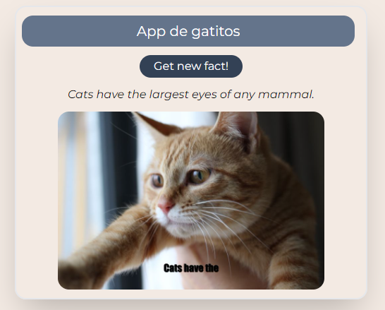

# Cat Facts App

Este é um aplicativo simples desenvolvido em React que exibe fatos aleatórios sobre gatos e imagens correspondentes. A aplicação consome uma API pública para obter os fatos e utiliza outra API para gerar imagens de gatos com base nos primeiros três termos do fato obtido.

## Funcionalidades

- Obtenção de um fato aleatório sobre gatos.
- Geração de uma imagem de gato baseada nas primeiras três palavras do fato.
- Botão para atualizar o fato e a imagem.

## Tecnologias Utilizadas

- **React**: Biblioteca JavaScript para construir interfaces de usuário.
- **Hooks personalizados**: `useCatFact` e `useCatImage` para lógica de busca e gerenciamento de estado.
- **API**: Consumo da API `catfact.ninja` para obter fatos sobre gatos.
- **Tailwind CSS**: Utilizado para estilização da interface.
- **Flowbite React**: Utilizado para componentes de estilização prontos.

## Instalación

1. Clona el repositorio:

```bash
git clone https://github.com/devHyrum/App-Gatitos
```
2. Navega al directorio del proyecto:
```bash
cd App-Gatitos
```
3. Instala las dependencias:
```bash
npm install
```

## Estrutura do Projeto

```bash
├── public
│   └── index.html
├── src
│   ├── App.jsx
│   ├── Hooks
│   │   ├── useCatFact.jsx
│   │   └── useCatImage.jsx
│   ├── Services
│   │   └── facts.js
│   ├── Otro.jsx
│   ├── main.jsx
│   └── index.css
├── package.json
└── README.md
```
## Personalização
Você pode modificar a URL da API de fatos ou ajustar a estilização do aplicativo editando o arquivo index.css ou os arquivos JSX.

## Contribuição
Contribuições são bem-vindas! Sinta-se à vontade para abrir issues ou enviar pull requests.